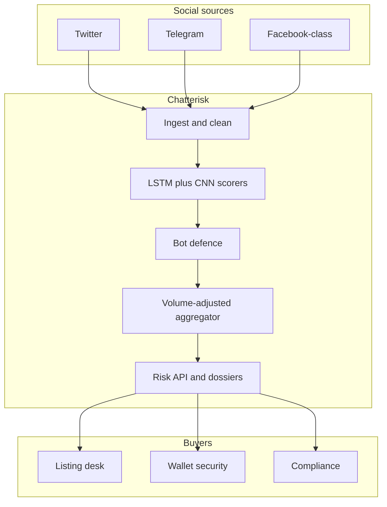

# Chatterisk

**Source:** `ai-in-decentralized+ai/research-paper_1811.11136v1/`
**Domain:** `ai-decentralized`
**One-liner:** A crypto-project social-risk console that scores Ethereum-community chatter with volume-adjusted sentiment so retail and compliance teams can see fraud and hype signals before they buy or list a token.
**Wedge:** Centralised exchange listing desks, crypto wallet/security apps, and compliance teams screening ICO/token projects where social channels are the primary discovery surface and ~80%+ of offerings since 2017 have been scams per industry research cited in the source.
**Positioning:** Continuous social-opinion risk for digital assets. Generic brand-sentiment tools ignore token-specific volume bias and crypto slang; Chatterisk combines LSTM+CNN sentiment with a volume-weighted project score and is designed to sit beside — not replace — smart-contract vulnerability scanning as the dual defence the paper names.

## Market research synthesis

### Thesis from source

Ethereum’s popularity as a smart-contract and Dapp platform flooded social networks with cryptocurrency commentary. That commentary is how retail discovers projects — and how fraud scales. The paper cites Satis Group Crypto Research that around 81% of ICOs launched since 2017 turned out to be scams, notes University of Pennsylvania findings on weak investor protections against insider self-dealing, and records that Google, Facebook, and Twitter moved to ban crypto/ICO ads while China banned virtual-currency transaction services and ICO activity after fraudulent pyramid schemes. Social opinion is therefore both the marketing channel and the attack surface.

The authors build a sentiment system on Facebook, Twitter, and Telegram comments: Stanford NLP tokenisation (strip username/hashtag/URL noise), 100-d GloVe Twitter embeddings, and an LSTM+CNN architecture (LSTM for contextual essay features, CNN for local sentiment features, SELU hidden layers). Two heads: softmax positive/negative probabilities, and tanh continuous scores in [-1, 1] that better handle neutral text. Training uses Sentiment140 (1.6M tweets) and Amazon reviews; validation spans SST, SentiWordNet, IMDB/Yelp/Amazon sets. Reported precision and recall exceed 0.80 on their evaluation; tanh outperforms softmax when neutrals dominate. Critically, raw mean sentiment fails when project A has 1,000 comments and project B has one at the same average — so they introduce a volume-adjusted score \(Score^{adj}_x = Score^{orig}_x \times W_x\) where weight \(W_x\) is the project’s comment mass over a time window divided by the max mass among tokens. The system was deployed into RatingToken and Cheetah Mobile’s Coin Master apps via REST API to surface fake/fraud risk detail to end users. The paper also states that resolving risk requires *both* social-opinion analysis *and* smart-contract vulnerability detection — a product boundary Chatterisk respects by emitting social risk as a first-class object that can be correlated with external scan results.

### Buyer & economic model

- **Primary buyer:** Head of Listings / Market Integrity at a CEX or crypto brokerage; secondary: consumer wallet security product owners; tertiary: fund compliance officers screening token exposure.
- **Users:** listing analysts, trust & safety reviewers, compliance investigators, wallet app backends, retail power users via partner apps.
- **Budget owner / value metric:** market integrity / compliance budget (or consumer security ARPU for wallets). Value metric is scam/hype projects flagged before listing or user purchase, precision of high-risk alerts, and reduction in post-listing social-fraud incidents.
- **Competing status quo:** manual Telegram reading, generic Brandwatch-style tools without crypto volume adjustment, influencer dashboards, and post-hoc Twitter searches after a blow-up.

### Domain constraints

- **Regulatory / trust / safety:** scores must not be marketed as investment advice; jurisdictions ban ICO advertising and some crypto services — the product is a risk signal, not a recommendation to buy. Manipulation (paid shills, bot swarms) can poison sentiment; volume weighting helps but bot defence is mandatory.
- **Data sensitivity:** social text may include PII; retention and scraping must respect platform ToS and privacy law. Project dossiers are commercially sensitive for listing desks.
- **Change-management realities:** listing workflows already have KYC/tech questionnaires; Chatterisk must plug in as a scored signal with explainable top comments, not a black-box veto without appeal.

## Business requirements

- BR-1: Every monitored project must receive a continuous sentiment score in [-1, 1] plus polarity probabilities, refreshed on a defined ingest cadence per channel.
- BR-2: Project-level rankings must apply volume-adjusted weighting so low-sample hype cannot tie or beat high-sample consensus without disclosure of sample size.
- BR-3: Analysts must see explainability artefacts: top contributing comments, channel mix, and time-window used for the adjusted score.
- BR-4: Bot/spam-suspect traffic must be segregated or down-weighted before it moves the project score, with the exclusion volume reported.
- BR-5: High-risk thresholds must be configurable per workspace (listing desk vs retail wallet) and produce alert events rather than silent dashboard changes.
- BR-6: The product must support correlation handles (contract address, ticker, project id) so customers can join social risk with external bytecode vulnerability results without Chatterisk performing that scan itself.
- BR-7: Scores are labelled as risk intelligence, not investment recommendations, in API responses and UI copy.
- BR-8: Data retention for raw comments must honour platform and privacy constraints, with deletion and anonymisation controls for PII-bearing text.
- BR-9: Model versions for tanh/softmax heads must be versioned; historical project scores remain reproducible for compliance lookbacks.
- BR-10: Customers must export a period dossier suitable for listing-committee packs: score trajectory, volume, sample size, and alert history.
- BR-11: Neutral-heavy windows must prefer continuous scoring behaviour; binary-only presentation is insufficient when neutrals dominate.
- BR-12: Commercial success is measured by pre-listing catches and false-alert burden, not by comment volume scraped.

## User stories

Canonical user stories live in sibling [USER_STORIES.md](USER_STORIES.md).

## System design

### Overview

Chatterisk crawls or receives social comments for registered crypto projects, cleans and embeds text, scores each comment with LSTM+CNN heads, aggregates to volume-adjusted project scores over configurable windows, applies bot filters, and exposes alerts, dossiers, and partner APIs. Correlation ids allow customers to attach external contract-scan references without folding bytecode analysis into this product.

### Actors & boundaries

- **Actors:** listing analysts, trust & safety, compliance, wallet backends, end retail users (via partners), platform operators.
- **Trust boundary:** social platforms remain upstream systems of record for speech; Chatterisk stores derived scores and necessary comment excerpts under retention policy. It does not custody user funds or execute trades.
- **Human-in-the-loop points:** coordinated-inauthentic labelling; threshold policy; appeal of a high-risk flag before listing veto.

### Core capabilities

1. **Project registry** — tickers, contract addresses, aliases, watchlists.
2. **Social ingest** — Twitter/Telegram/Facebook-class channels and partner firehoses.
3. **Comment scoring** — tanh and softmax sentiment inference.
4. **Volume-adjusted aggregation** — windowed project scores with sample-size disclosure.
5. **Bot and spam defence** — down-weighting and analyst marking.
6. **Alerting and dossiers** — threshold events and committee exports.
7. **Correlation links** — attach external vulnerability-scan references.

### Conceptual data

- **Primary entities:** Project, SocialChannel, Comment, SentimentScore, ProjectAggregate, BotRuling, Alert, DossierExport, ExternalScanLink, ModelVersion.
- **Critical events:** comment ingested, comment scored, aggregate refreshed, bot ruling applied, alert fired, dossier exported, external scan linked.
- **Retention / audit needs:** aggregates and alerts retained for compliance lookback; raw comments minimised and redacted on schedule; model versions immutable.

### Integrations (conceptual)

- **Systems of record:** social APIs, customer watchlists, listing CRM, wallet backends.
- **Upstream signals:** GloVe/embedding corpora, spam reputation feeds, token registry metadata.
- **Downstream actions:** listing-committee packs, wallet risk badges, SIEM/alert webhooks, joins to external scanners.

### High-level architecture

### Success metrics

- **Leading:** median time from comment publish to project-score update; % projects with adequate sample size; bot-downweight share; alert acknowledge latency.
- **Lagging:** scam/hype projects flagged pre-listing; false-alert rate on committee decisions; partner wallet engagement on risk badges; paid workspace retention.

## OpenAPI skeleton

Canonical HTTP surface lives as one OpenAPI file per domain under [`packages/openapi-core/src/`](packages/openapi-core/src/). Root [openapi.yaml](openapi.yaml) is a pointer only.

- **Base path:** `/v1/...` (identity remains `/v0/...`)
- **Auth:** API key for partner apps; Bearer JWT for analyst consoles
- **Domains:** Projects, Comments, Aggregates, Alerts, Dossiers, ExternalLinks
