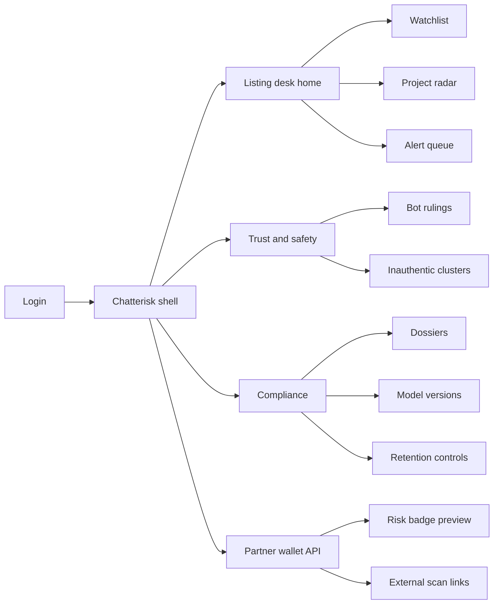
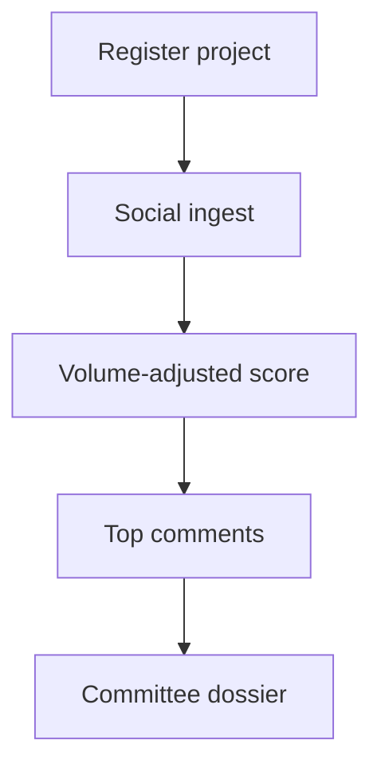
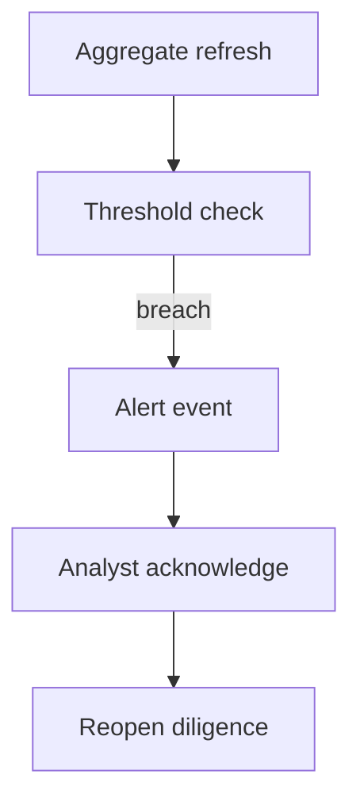

# Chatterisk — Web app

**Product:** [PRODUCT.md](./PRODUCT.md)
**Primary surface:** Listing / market-integrity social-risk console
**Secondary surfaces:** Partner wallet risk-badge API docs viewer; compliance dossier export room; trust & safety bot-ruling desk
**Design thesis:** Chatterisk is a volume-honest chatter radar for crypto projects — sentiment without sample-size lies. The metaphor is a signal tower that weights how *much* was said, not a generic brand-listening daisy. Visual language is night-ops indigo-ink (not purple product UI) with radar-lime for stable consensus and flare-coral for high-risk collapses: thin samples feel translucent; bot-downweighted mass feels struck through; every screen reminds that this is risk intelligence, not investment advice. The wordmark sits as a quiet tower mark on every dossier-bearing view so listing committees know whose volume-adjusted score they are citing.

## UX research synthesis

### Category peers (best-in-class)

- **Brandwatch / Meltwater (enterprise social listening):** Channel mix, theme drill-downs, exportable briefings. Steal: top contributing comments and channel mix; reject brand-marketing vanity as the crypto listing home.
- **Chainalysis KYT / TRM screening consoles:** Risk scores with explainability and compliance export. Steal: threshold alerts + dossier packs for committees; reject equating on-chain KYT with social opinion — Chatterisk stays social-first.
- **LunarCrush / Santiment (crypto social analytics):** Token-centric volume and sentiment. Steal: project-keyed time windows and volume context; reject “buy the spike” gamification and influencer leaderboards as primary UX.
- **Twitter/X Moderation / Trust & Safety tools:** Bot/spam segregation and coordinated behaviour marking. Steal: bot-downweight with exclusion volume reported; reject opaque shadow scores without analyst appeal.

### Patterns to adopt / reject

- **Adopt:** Continuous score in [-1,1] plus polarity; volume-adjusted ranking with sample-size disclosure; explainable top comments; bot segregation; configurable workspace thresholds; correlation handles to external vuln scans; “not investment advice” labelling; model-versioned reproducible history; committee dossiers.
- **Reject:** Raw mean sentiment as the headline; binary-only when neutrals dominate; black-box veto without comments; replacing contract scanners; buy/sell CTAs; purple hype dashboards; scraping UI that ignores retention/PII.

### Trust, density, and workflow constraints from PRODUCT.md

Continuous scores refreshed per channel cadence (BR-1). Volume-adjusted ranking with sample disclosure (BR-2). Explainability artefacts required (BR-3). Bot/spam down-weight with reported exclusion volume (BR-4). Configurable thresholds → alerts (BR-5). Correlation handles to external scans — Chatterisk does not scan bytecode (BR-6). Risk intelligence labelling, not investment advice (BR-7). Retention/redaction for PII (BR-8). Model versions for lookbacks (BR-9). Period dossier export (BR-10). Prefer continuous scoring when neutrals dominate (BR-11). Success = pre-listing catches vs false-alert burden (BR-12).

## Information architecture

### Nav model

### Roles → default home

| Role | Default home | Why |
|------|--------------|-----|
| Listing analyst | Watchlist / project radar | Volume-adjusted score before committee |
| Trust & safety | Bot rulings | Manufactured consensus called out |
| Compliance officer | Dossiers | Evidentiary trail (BR-10) |
| Wallet security PM | Risk badge preview | Contract-address keyed partner API |
| Platform admin | Thresholds + retention | Workspace cutoffs and PII controls |

### Cross-links to OpenAPI resources

| Nav area | OpenAPI tags / resources |
|----------|---------------------------|
| Registry / watchlists | Projects |
| Comment drill-down | Comments |
| Volume-adjusted scores | Aggregates |
| Threshold events | Alerts |
| Committee packs | Dossiers |
| Vuln-scan correlation | ExternalLinks |

## Screen inventory

### Listing desk home

- **Purpose:** Answer “which watched tokens show high-risk social collapse or thin-sample hype — before listing?”
- **Entry:** Listing analyst login.
- **Layout regions:** Brand tower mark; “Risk intelligence — not investment advice” strip; watchlist table (adj score, sample size, bot-downweight %, sparkline); alert rail.
- **Primary actions:** Open project; acknowledge alert; start dossier.
- **Empty / loading / error:** Empty = add projects by ticker/address; error with request id.
- **BR / story ties:** BR-2, BR-5, BR-7, BR-12.

### Project radar

- **Purpose:** Volume-adjusted sentiment with explainability for one project.
- **Entry:** Watchlist row; alert deep link.
- **Layout regions:** Score gauge [-1,1] + polarity probs; sample size and window; channel mix; top positive/negative comments; bot exclusion volume; model version; external scan link slot.
- **Primary actions:** Change window; open comment; link external scan; export slice.
- **Empty / loading / error:** Thin sample = translucent score + warning; never hide n.
- **BR / story ties:** BR-1, BR-2, BR-3, BR-6, BR-11.

### Comment evidence drawer

- **Purpose:** Verify model isn’t misfiring on sarcasm or ticker collisions.
- **Entry:** Top comments on radar.
- **Layout regions:** Cleaned text; channel; per-comment score; bot suspect flag; analyst mark controls.
- **Primary actions:** Mark coordinated inauthentic; redact PII; open source permalink if retained.
- **Empty / loading / error:** Retention expiry = placeholder “text purged — aggregate retained.”
- **BR / story ties:** BR-3, BR-4, BR-8.

### Alert queue

- **Purpose:** Threshold events (collapse, spike, bot surge) — not silent dashboard drift.
- **Entry:** Alerts nav; webhook mirror.
- **Layout regions:** Severity; project; window; ack/SLA; link to radar.
- **Primary actions:** Ack; reopen diligence; snooze with audit.
- **Empty / loading / error:** Empty = healthy; not a blank void.
- **BR / story ties:** BR-5; listing analyst stories.

### Bot and inauthentic desk

- **Purpose:** Segregate/down-weight spam before it moves the project score; report exclusion volume.
- **Entry:** Trust & safety home.
- **Layout regions:** Suspect volume; cluster tools; ruling history; impact on adj score preview.
- **Primary actions:** Apply ruling; reverse with note.
- **Empty / loading / error:** Empty = no active rulings.
- **BR / story ties:** BR-4; T&S stories.

### Workspace thresholds

- **Purpose:** Different cutoffs for listing desk vs retail wallet without one blunt global.
- **Entry:** Admin / listing settings.
- **Layout regions:** Workspace selector; threshold editor; alert routing; NIA disclaimer lock.
- **Primary actions:** Save; test alert.
- **Empty / loading / error:** Missing disclaimer copy blocked.
- **BR / story ties:** BR-5, BR-7.

### External scan correlation

- **Purpose:** Attach contract-scan references so dual defence is visible without Chatterisk scanning bytecode.
- **Entry:** Project radar; Partner links.
- **Layout regions:** Correlation handles (address, ticker, project id); external scan id; combined partner preview (social + code risk badges side by side).
- **Primary actions:** Link; unlink; copy partner badge payload.
- **Empty / loading / error:** No scan linked = social-only badge with explicit gap.
- **BR / story ties:** BR-6; wallet PM stories.

### Compliance dossier export

- **Purpose:** Period pack: trajectory, volume, sample size, alerts, model version for listing committee.
- **Entry:** Compliance home.
- **Layout regions:** Period picker; checklist; preview; download; NIA watermark.
- **Primary actions:** Generate; verify hash; share to committee room.
- **Empty / loading / error:** Incomplete window = warn.
- **BR / story ties:** BR-9, BR-10.

### Retention and redaction controls

- **Purpose:** Honour platform/privacy constraints on raw comments.
- **Entry:** Compliance / DPO.
- **Layout regions:** Retention schedules; PII redaction status; deletion jobs; aggregate retention separate from raw text.
- **Primary actions:** Run redaction; export privacy attestation.
- **Empty / loading / error:** Failed deletion job = coral incident.
- **BR / story ties:** BR-8.

### Partner risk-badge preview

- **Purpose:** Lightweight wallet-facing badge keyed by contract address.
- **Entry:** Partner surface.
- **Layout regions:** Badge states; API example; NIA microcopy; linked external scan optional.
- **Primary actions:** Copy embed; rotate API key.
- **Empty / loading / error:** Unknown address = insufficient-sample state.
- **BR / story ties:** BR-6, BR-7; wallet PM stories.

## Key flows

1. **Pre-listing screen** — register project → ingest → volume-adjusted score → open evidence → dossier for committee; failure: thin sample disclosed, not treated as consensus.

2. **Sentiment collapse alert** — threshold breach → alert → analyst ack → reopen diligence.

3. **Bot ruling** — suspect cluster → T&S mark → down-weight → exclusion volume on radar (BR-4).

4. **Dual defence join** — attach external vuln scan id → partner badge shows social + code risk (BR-6).

5. **Compliance lookback** — select period → reproducible scores under model version → export dossier (BR-9, BR-10).

## Design system

### Tokens (CSS variables)

- `--color-ink: #E6EAF2` — text
- `--color-ops-950: #0A0F18` — ground
- `--color-ops-900: #121A28` — panels
- `--color-ops-700: #2A3548` — rules
- `--color-radar: #7CF0A4` — stable / adequate sample (lime, not neon purple)
- `--color-radar-dim: #2F7A4E`
- `--color-flare: #F07167` — high-risk collapse
- `--color-thin: #6B7385` — translucent thin-sample
- `--color-tower: #5B7C99` — brand steel (indigo-ink, not purple UI)
- `--color-mute: #8B95A8`
- `--font-display: "Outfit", sans-serif` — radar titles
- `--font-body: "IBM Plex Sans", sans-serif`
- `--font-mono: "IBM Plex Mono", monospace` — addresses, scores, model versions
- `--space-1`…`--space-8`: 4px scale
- `--radius-sm: 4px`; `--radius-md: 8px`
- `--motion-sweep: 280ms ease-in-out` — radar refresh
- `--motion-flare: 180ms ease-out` — alert appear
- `--motion-thin: 200ms ease-out` — thin-sample opacity
- Atmosphere: night-ops grid and soft radar sweep — social risk tower; avoid purple-on-white SaaS; no cream-terracotta; no broadsheet; no buy buttons.

### Typography & brand

- Outfit for project names and scores; mono for addresses and model versions.
- Chatterisk wordmark on every dossier- and alert-bearing view.
- Persistent microcopy: “Risk intelligence — not investment advice.”
- Login: brand + one headline on volume-honest social risk + one CTA.

### Do / don’t

- **Do:** Disclose sample size; show bot exclusion volume; explain with comments; label NIA; correlate external scans without owning them.
- **Don’t:** Raw mean as headline; binary-only neutrals; investment CTAs; purple hype; silent threshold changes; bytecode scanner feature creep.

### Accessibility & domain trust cues

- Risk never colour-only — numeric score + label.
- Live regions for alerts.
- Focus: watchlist → radar → comments → dossier.
- Dossiers watermarked NIA for committee misuse resistance.

## Component patterns

- **VolumeAdjustedScore** — score with sample size and window.
- **ThinSampleVeil** — translucent treatment when n is inadequate.
- **TopCommentEvidence** — driving positive/negative excerpts.
- **BotExclusionMeter** — down-weighted volume reported.
- **RiskAlertRow** — threshold event with ack.
- **NiaDisclaimerStrip** — locked not-investment-advice chrome.
- **ExternalScanLinkChip** — correlation to vuln scan without scanning here.
- **CommitteeDossierExport** — period pack with model version.
- **PartnerRiskBadge** — wallet-facing compact state.

## Out of scope for v1 web

- Smart-contract vulnerability scanning (correlate only); trade execution; custody; ICO launchpad; influencer CRM; full social network; investment recommendations; scraping that violates platform ToS.
